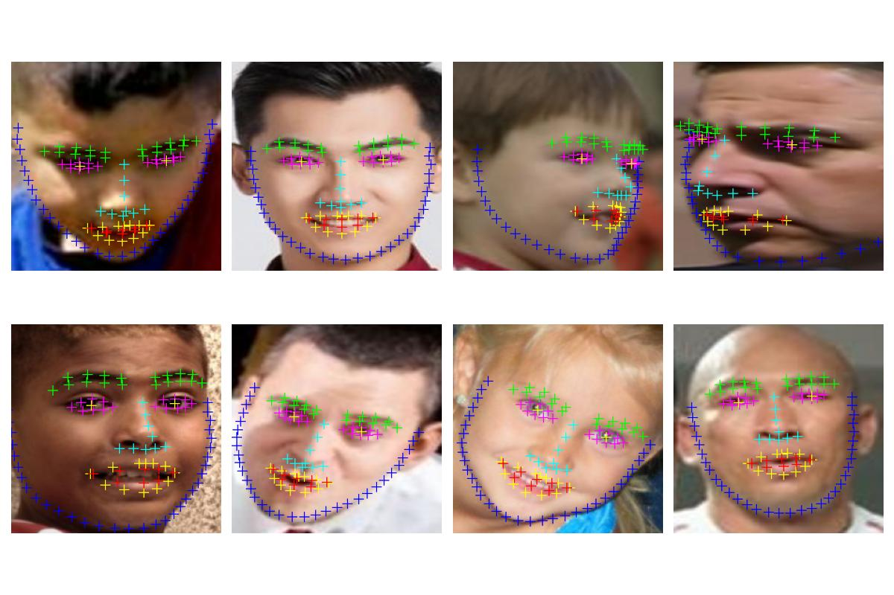
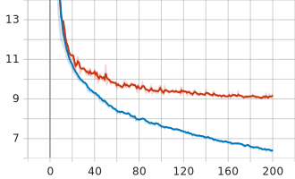

# Face Landmark Estimation
The goal of this side project is to create and train a model to estimate the location of 98 face landmarks.
These landmarks can be used for head pose estimation, sentiment analysis, action recognition, face filtering and more.

## Dataset
As dataset, I chose the Wider Facial Landmarks in-the-wild ([WFLW](https://wywu.github.io/projects/LAB/WFLW.html))[^1] from Wayne Wu et al., containing a total of 10000 annotated faces (7500 for training and 2500 for testing).
The following figure shows where the landmarks are located:

### Training Pipeline
For the first implementation of this model, we assume that the input model will already be cropped around each face by another algorithm.
Next models, might take as input directly the entire image without face pre-detection.

The dataset provides along each landmarks annotation list, the corresponding face bounding box. 
Hence, each training image is first cropped (while still keeping a padding mask around the box), converted into float32, resized to 224x224 and lastly, normalized with a mean equal to 0.5.

## Models
Although the heatmap based methods seems to be more accurate in this type of tasks, I decide to start with a traditional convolutional architecture.
Then, based on results and future developments, other approaches may be taken into consideration.

|  model   | test loss |
|:--------:|:---------:|
| ResNet50 |   10.1    |

### First Version
The first version is a standard CNN architecture using ResNet50[^2] as backbone. 
The last layer of the ResNet has been changed to produce a 196 dimensional output tensor, i.e. 
_x,y_ for each one of the 98 markers.
The model has been trained for 200 epochs using Wing loss[^3].

Model 1 outputs on test set elements:

The following plot contains training loss (blue) and validation loss (red):

[^1]: [Look at Boundary: A Boundary-Aware Face Alignment Algorithm](https://doi.org/10.48550/arXiv.1805.10483)

[^2]: [Deep Residual Learning for Image Recognition](https://doi.org/10.48550/arXiv.1512.03385)

[^3]: [Wing Loss for Robust Facial Landmark Localisation with Convolutional Neural Networks](https://doi.org/10.48550/arXiv.1711.06753)